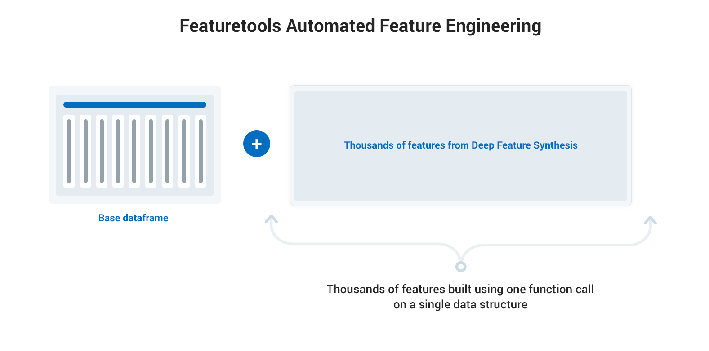
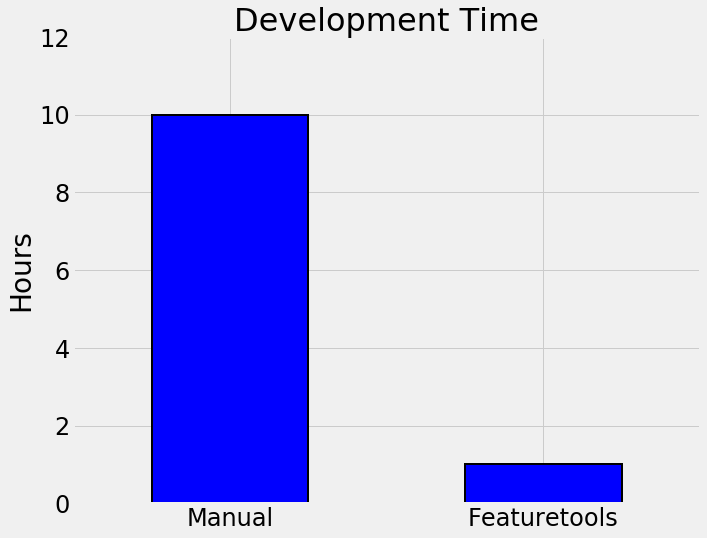
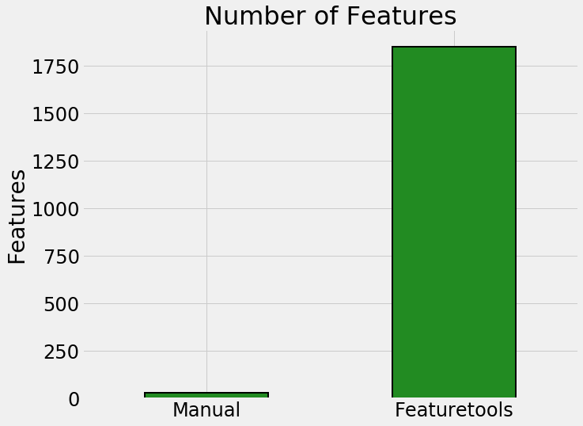
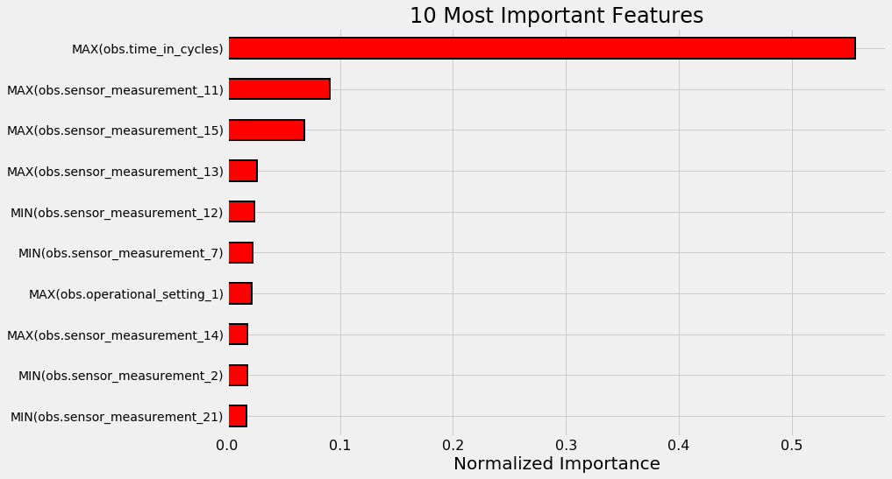

# Manual vs Automated Feature Engineering Comparison 

  
   

The traditional process of manual feature engineering requires building one feature at a time by hand
informed by domain knowledge. This is tedious, time-consuming, error prone, and perhaps most importantly,
specific to each dataset, which means the code will have to be _re-written for each problem._ 

Automated feature engineering with Featuretools allows one to create thousands of features
automatically from a set of related tables using a framework that can be easily applied to any problem.

  

# Highlights

Featuretools offers us the following benefits:

1. __Up to 10x reduction in development time__
2. __Better predictive performance__
3. __Interpretable features with real-world significance__
4. __Fits into existing machine learning pipelines__
5. __Ensures data is valid in time-series problems__

Automated feature engineering will change the way you do machine learning by allowing you to 
develop better predictive models in a fraction of the time as the traditional approach.

## Article

For the highlights of the project, check out "Why Automated Feature Engineering
Will Change the Way You Do Machine Learning" on Towards Data Science ([Link](https://medium.com/@williamkoehrsen/why-automated-feature-engineering-will-change-the-way-you-do-machine-learning-5c15bf188b96))

# Results

Each of the 3 projects in this repository demonstrates different benefits of using automated
feature enginering. 

1. __Loan Repayment Prediction: Build Better Models Faster__

Given a dataset of 58 millions rows spread across 7 tables and the task of predicting whether or not a client
will default on a loan, Featuretools delivered a better predictive model in a fraction of the time
as manual feature engineering. The features built by Featuretools are also human-intrepretable 
and can give us insight into the problem:

  
   
  

2. __Retail Spending Prediction: Ensure Models Use Valid Data__

When we have time-series data, we traditionally have to be extremely careful about making
sure our model only trains on valid data. Often, a model will work in development only to completely fail in deployment
because the training data was not properly filtered based on the time. Featuretools can take care 
of time filters _automatically_, allowing us to focus on other aspects of the machine learning pipeline
and delivering better overall predictive models:

  

3. __Engine Life Prediction: Automatically Create Meaningful Features__

In this problem of predicting how long an engine will run until it fails, we observe that 
Featuretools creates meaningful features which can inform our thinking about real-world problems
as seen in the most important features:

  

# Scaling with Dask

For an example of how Featuretools can scale - either on a single machine or a cluster - see the 
[Featuretools on Dask notebook](https://github.com/Featuretools/Automated-Manual-Comparison/blob/master/Loan%20Repayment/notebooks/Featuretools%20on%20Dask.ipynb).

  

## Feature Labs

Featuretools is an open source project created by [Feature Labs](https://www.featurelabs.com/). To see the other open source projects we're working on visit Feature Labs [Open Source](https://www.featurelabs.com/open). If building impactful data science pipelines is important to you or your business, please [get in touch](https://www.featurelabs.com/contact.html).

### Contact

Any questions can be directed to help@featurelabs.com
