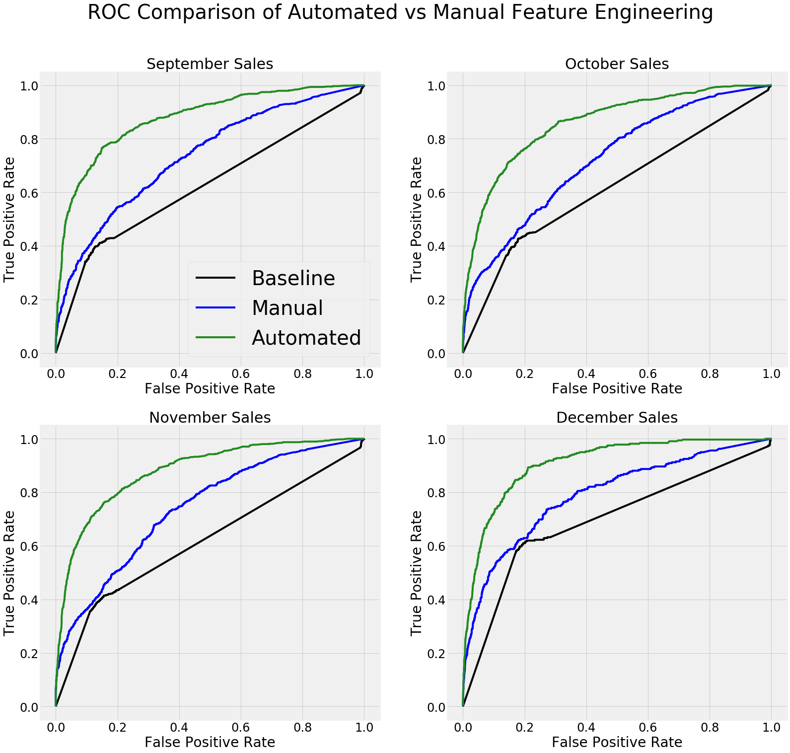

# Retail Spending Prediction

A comparison of automated feature engineering using Featuretools and manual feature engineering
for predicting customer spending using retail data transactions. 

### Notebooks

The notebooks for this project are:

1. `Automated Retail Spending.ipynb`
2. `Manual Retail Spending.ipynb`

`utils.py` contains a number of useful helper functions.

### Data

The original data can be dowloaded from the UCI Machine Learning Repository [here](https://archive.ics.uci.edu/ml/datasets/online+retail#).

To run the notebooks, either use the provided S3 URL (`s3://featurelabs-static/online-retail-logs.csv`) or 
download the data from the UCI Machine Learning Repository. The data from the S3 link is the same 
as the raw data from UCI expect the column have been renamed for clarity. 

